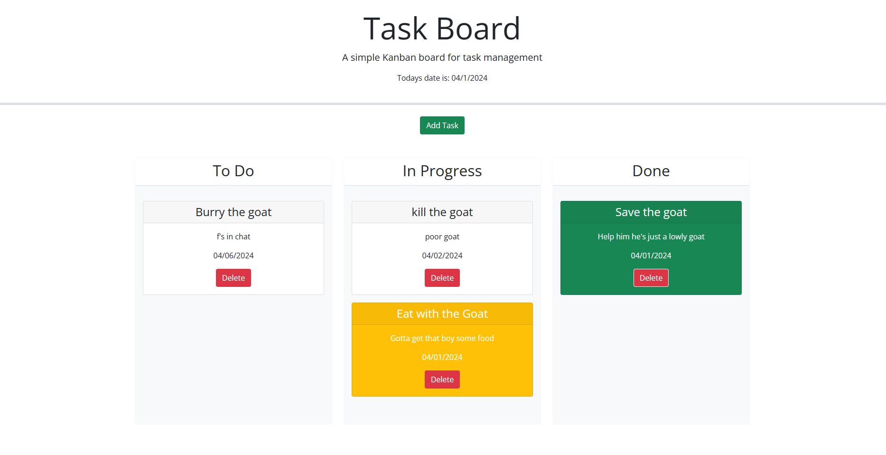

# Task-Board

## Description

To better understand APIs like jquery and bootstrap ive taken to adding functionality to this task board. In doing so i have created a fully functional task board witha modal input, task lanes for progress and delete buttons for removing tasks.

## Usage

to create a task click add a task and then fill out the form in the modal with your task title due date and description. Then simply click Add task again. To change the progress drag and drop the task from one lane to the other. tasks in the "done" lane will display as green and tasks in "in progress" or "to-do" will be white or yellow if they are due today or past due.

## Deployed application

https://ownerman123.github.io/

## ScreenShots

## license

Refer to licesne in repo.